# TestOIDCBlazorWASM

Cette application exemple montre un **client Blazor WebAssembly** qui se connecte à un **serveur ASP.NET Core** qui porte le téléchargement de la Single Page Application ainsi qu'une exposition d'API, les deux
étant authentifiés par un serveur d'identité **OpenID Connect** implémenté en **KeyCloak**. La persistance
de l'API est assurée par une base **MongoDB** pour les données, et une **GED Nuxeo** appelée en norme CMIS
pour les documents. Les documents sont générés en asynchrone par un client **console .NET Core** qui
lit une queue de message **RabbitMQ** et modifie la persistance par une seconde entrée d'API, protégée
cette fois par un mécanisme **ClientCertificate**. Cette seconde exposition d'API se fait sur un autre 
port que la première mais avec une implémentation unique, les deux contrôleurs se basant sur une 
seule et unique classe abstraite, en ne surchargeant que les politiques d'accès.

Afin de ne pas encombrer le présent fichier, qui a juste pour objectif de permettre de lancer l'application, les détails sur la conception, les problèmes rencontrés, les choix architecturaux et leurs avantages seront exposés à part, sur plusieurs articles d'une même catégorie dans le blog http://gouigoux.com/blog-fr/?tag=TestOIDCBlazorWASM.

# Prérequis

Pour fonctionner, l'application a besoin des serveurs satellites suivants, pour lesquels on montrer la commande recommandée d'initialisation en mode Docker.

### KeyCloak

```
docker run -p 8080:8080 -e KEYCLOAK_ADMIN=admin -e KEYCLOAK_ADMIN_PASSWORD=admin quay.io/keycloak/keycloak:18.0.2 start-dev
```

L'interface de KeyCloak est disponible sur http://localhost:8080/admin/, et les crédentiels sont ceux indiqués en paramètre du lancement du conteneur. Le paramétrage recommandé est le suivant :

1. Créer un nouveau tenant d'authentification (```AddRealm``` en haut à gauche, le nommer par exemple ```LivreENI```)
2. 

### RabbitMQ

```
docker run --rm -it --hostname my-rabbit -p 15672:15672 -p 5672:5672 rabbitmq:3-management
```

L'interface est disponible sur http://localhost:15672, le user par défaut est ```guest``` et le mot de passe par défaut ```guest```.

### MongoDB

```
docker run -p 27017:27017 -d --name db mongo:4.4
```

Pas d'interface web de gestion par défaut, mais Robo 3T est un excellent client, qui peut être téléchargé sur https://github.com/Studio3T/robomongo et reste gratuit à ce jour. A noter que, par défaut, l'accès à la base de données n'est pas sécurisé.

### Nuxeo

```
docker run -d --name ged -p 9000:8080 nuxeo
```

Par défaut, il faut utiliser le user ```Administrator``` et le mot de passe ```Administrator``` pour se connecter aux endpoints de la GED. Nous utiliserons le type ```AtomPub``` accessible sur http://localhost:9000/nuxeo/atom/cmis). Aucune interface graphique n'est disponible par défaut, mais il est possible d'activer un module Nuxeo pour cela, ou bien d'utiliser le client CMIS Apache Chemistry disponible sur http://archive.apache.org/dist/chemistry/opencmis/1.1.0/.

# Préparation des certificats

L'application utilisant pour partie une authentification de type ClientCertificate, il est nécessaire de préparer des certificats en lançant, en mode administrateur, les commandes PowerShell ci-dessous :

```
New-SelfSignedCertificate -DnsName "localhost", "localhost" -CertStoreLocation "cert:\LocalMachine\My" -NotAfter (Get-Date).AddDays(10) -FriendlyName "Rlocalhost" -KeyUsageProperty All -KeyUsage CertSign, CRLSign, DigitalSignature

$mypwd = ConvertTo-SecureString -String "Secret123" -Force -AsPlainText

Get-ChildItem -Path cert:\localMachine\my\09A6A4EA28ECA0447E1660119A45B6988E591500 | Export-PfxCertificate -FilePath C:\Users\jpgou\OneDrive\Securite\ClientCertificate\dotnet\root.pfx -Password $mypwd

$rootcert = ( Get-ChildItem -Path cert:\LocalMachine\My\09A6A4EA28ECA0447E1660119A45B6988E591500 )

New-SelfSignedCertificate -certstorelocation cert:\localmachine\my -dnsname "localhost" -Signer $rootcert -NotAfter (Get-Date).AddDays(10) -FriendlyName "Clocalhost"

$mypwd = ConvertTo-SecureString -String "Secret123" -Force -AsPlainText

Get-ChildItem -Path cert:\localMachine\my\6BDA0F3604953B518079FEE3E1DB18A3E1CCE9DE | Export-PfxCertificate -FilePath C:\Users\jpgou\OneDrive\Securite\ClientCertificate\dotnet\child.pfx -Password $mypwd
```

Les durées de validité, mots de passe (évidemment bidon) et localisations des fichiers sont bien sûr à adapter. Les valeurs ci-dessus sont celles utilisées dans les settings livrés avec le code source de l'application.

Le certificat racine ```root.pfx``` doit être placé dans les autorités de certification racines de confiance (clic-droit et ```Toutes les tâches``` puis ```Importer...```) :

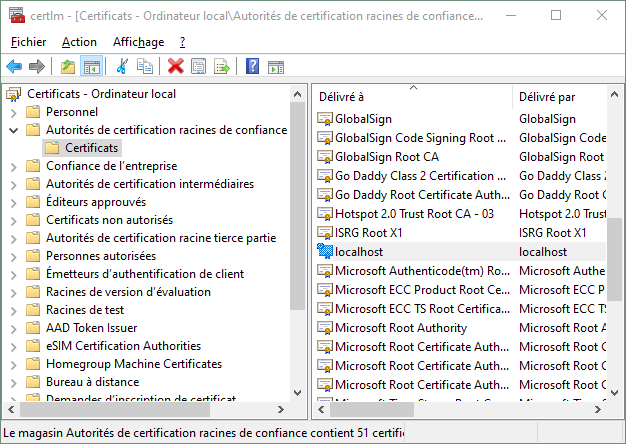

Si besoin pour tester les API protégées par Client Certificat dans le navigateur, on peut aussi installer le certificat ```child.pfx``` dans le magasin personnel de Chrome ou Edge. Pour Postman, la documentation explique comment enregistrer le certificat racine ainsi que le certificat client, mais je n'ai personnellement pas réussi à trouver comment le faire fonctionner, une erreur de type ```Hostname/IP does not match certificate's altnames``` restant présentes dans tous les cas.

# Lancement de l'application

Une fois les prérequis lancés, il convient de modifier les fichiers de configuration des projets (```appsettings.*```) si les ports ou crédentiels indiqués sur les prérequis ont été modifiés. Dans le cas du certificat, il est quasi-sûr que le chemin sera à adapter dans le projet ```TESTOIDCBlazorWASM.API```. Avant de démarrer la solution, il faut également vérifier que les propriétés de lancement sont comme suit :

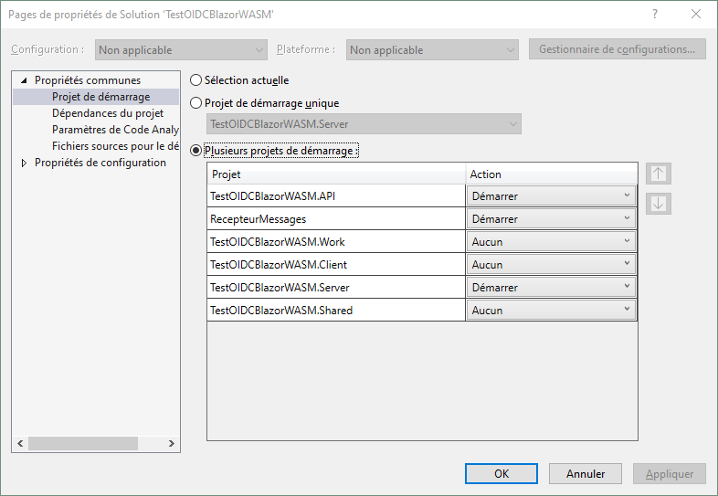

La solution peut ensuite être lancée depuis Visual Studio, avec la touche ```F5``` par exemple.

# Scénario de test nominal

L'écran d'accueil montre une application "vide", au sens où n'apparaissent que les fonctions existant par défaut dans le modèle d'application .NET :

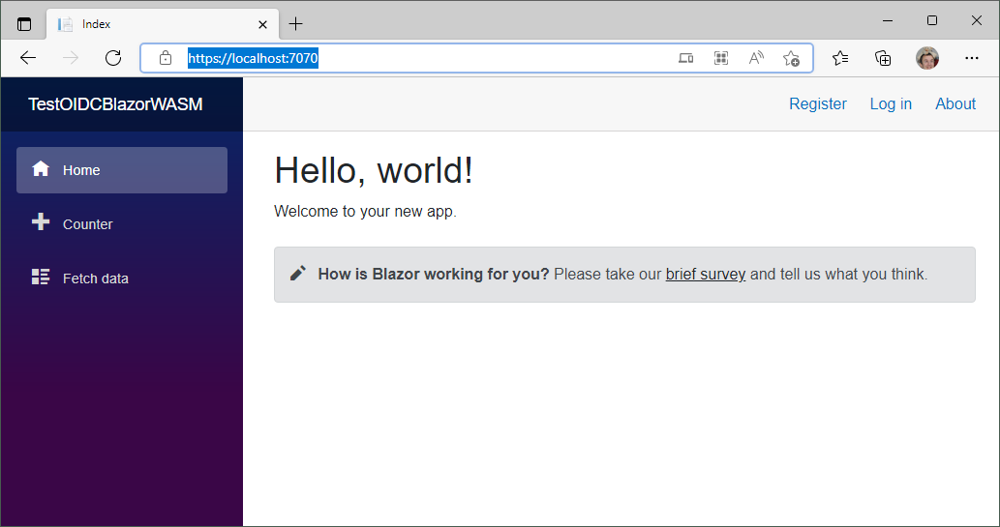

L'application est conçue pour que les menus de gestion des personnes n'apparaissent qu'une fois une authentification réalisée avec succès. Il faut pour cela utiliser le lien ```Log in``` en haut à droite de l'interface. La fenêtre qui apparaît alors est celle fournie par KeyCloak :

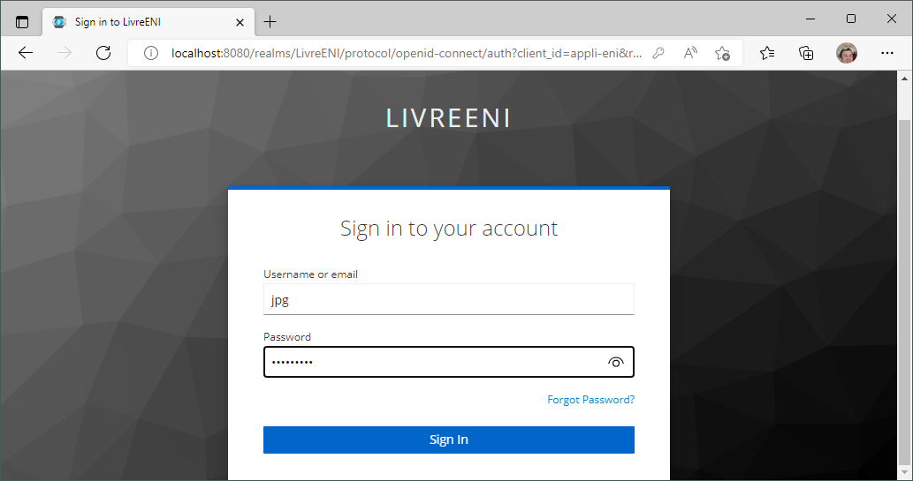

Si un utilisateur est connecté avec le rôle ```administrateur```, il verra alors les deux menus supplémentaires montrés ci-dessous, tandis qu'un utilisateur avec le rôle ```lecteur``` ne verra que le second :

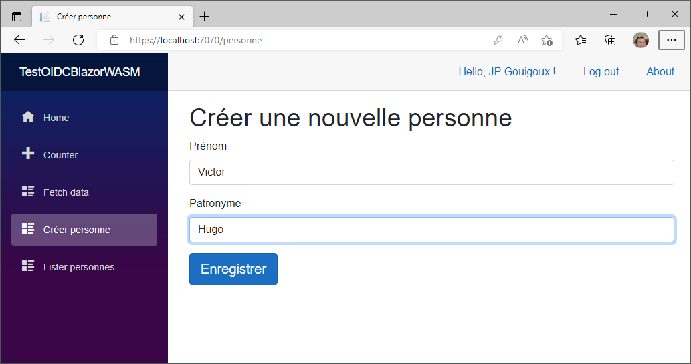

La création d'une nouvelle personne dans l'interface dédiée crée aussitôt une persistance dans la base de données, mais émet également un message dans une file RabbitMQ. Cette file est lue par le projet ```RecepteurMessages``` qui traite le message en créant une fiche PDF associée à la personne :

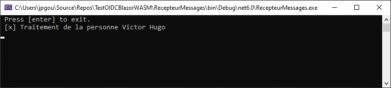

Ce traitement est suffisamment lent (grâce à un ```System.Thread.Sleep``` additionnel) pour qu'une bascule immédiate sur la liste des personnes montre une création partielle de la nouvelle entité :

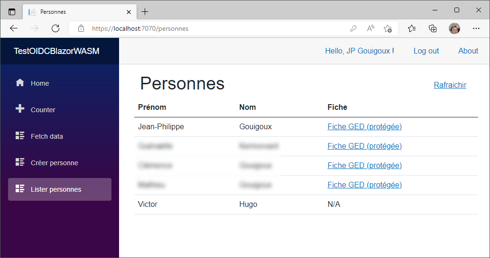

En attendant quelques secondes avant d'utiliser le bouton ```Rafraichir```, on obtient une interface mise à jour dans laquelle le lien vers la GED permet de télécharger le fichier PDF généré en lien avec la personne créée (en utilisant une connexion à la GED en mode ```Basic Authentication```, gérée normalement directement par le navigateur) :

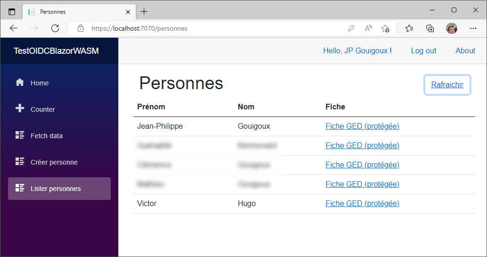

# Persistance

La persistance consiste en une simple collection dans la base MongoDB :

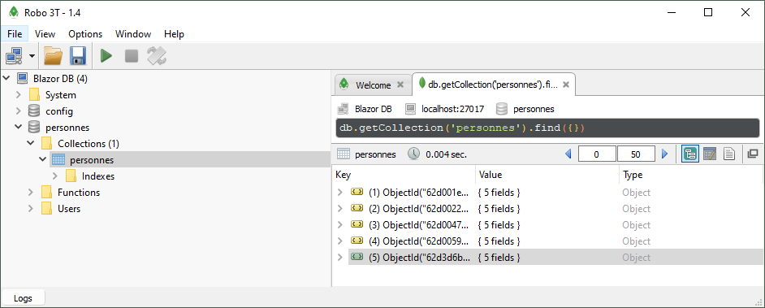

L'ouverture du document créé dans le scénario ci-dessus révèle la forme de l'URL permettant d'accéder à la fiche :

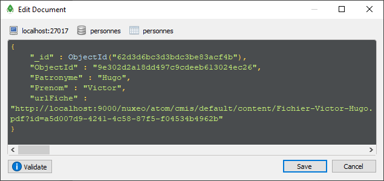

# Observation des documents

En-dehors de l'interface de l'application qui est extrêmement simple, il est également possible de constater le fonctionnement correct en se connectant avec le client Apache Chemistry Workbench sur la GED :

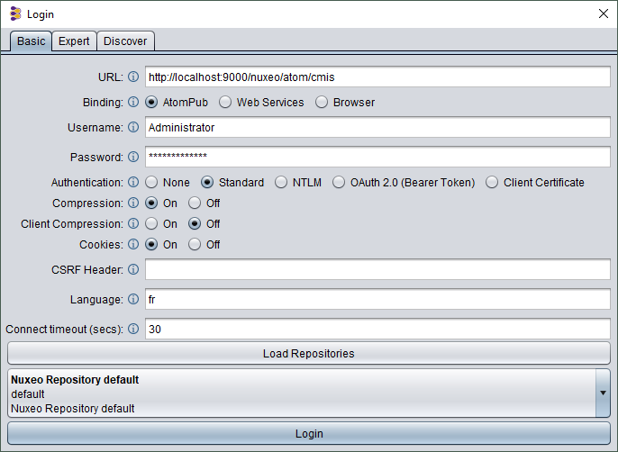

Une fois le dépôt par défaut choisi, l'interface permet de parcourir les contenus des répertoires, et en particulier celui créé automatiquement pour accueillir les PDF générés :

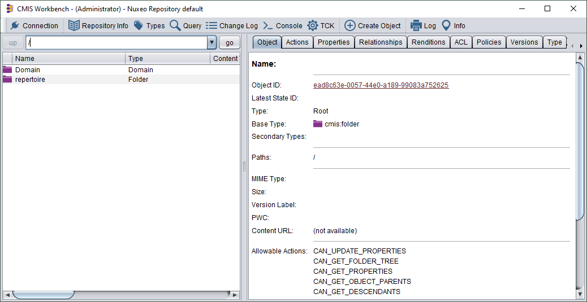

On peut accéder par ce biais à la fiche PDF générée, ou bien en utilisant directement le lien stocké dans MongoDB. Le contenu est généré arbitrairement, avec un appel à l'API publique de XKCD pour incorporer automatiquement une image dans le fichier :

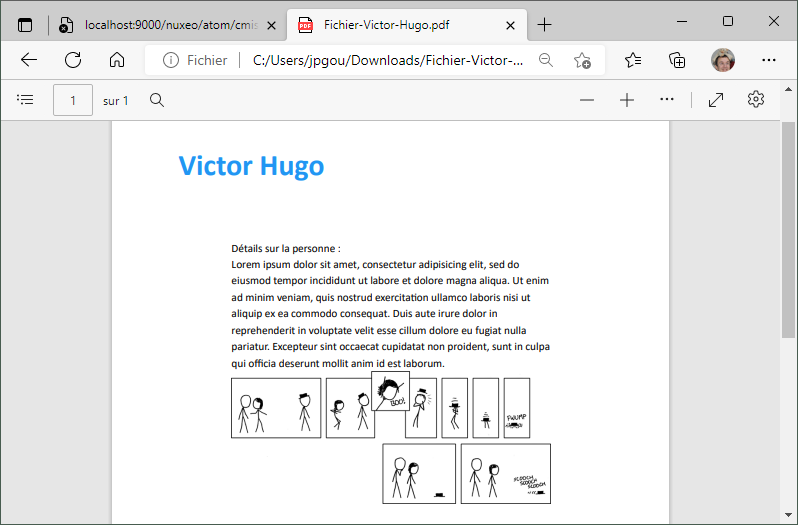

# Structure

L'application est une solution Visual Studio 2022 avec 6 projets :

- **Client** est une SPA de type Blazor WASM qui permet à un utilisateur avec un rôle ```lecteur``` de lire une liste de personnes et un utilisateur avec un rôle ```administrateur``` de créer des personnes en plus dans la liste. L'application servant uniquement de test d'architecture, une entité de type personne ne contient que deux attributs, à savoir son prénom et son nom (ainsi bien sûr qu'un identifiant technique dans MongoDB, qui servira à créer une URL de ressource unique de type REST). L'accès à l'application est régulé par une authentification de type OpenID Connect fournie par le serveur KeyCloak. C'est le jeton d'identité JSON Web Token qui porte les rôles, en plus des autres claims standards permettant, par exemple, de nommer l'utilisateur authentifié dans le haut de l'interface.
- **Server** est une application de type ASP.NET Core qui supporte à la fois l'exposition du client SPA détaillé ci-dessus, mais aussi l'exposition de l'API REST permettant d'interagir avec les personnes sous couvert de la même authentification OIDC que le client, mais avec cette fois une utilisation du jeton d'accès JWT. Le serveur est normalement exposé sur le port 7070.
- **API** est une autre application de type ASP.NET Core qui expose la même API REST de gestion des personnes, mais cette fois derrière une authentification de type Client Certificate basée sur le certificat créé plus haut, juste après la mise en place des prérequis. Elle est dédiée aux appels par des clients de type non-interactif.
- **RecepteurMessages**, justement, est une application de type Console qui tourne en boucle, lit le contenu de la queue de messages RabbitMQ à l'écoute de nouvelles personnes, et traite cet évènement en réalisant trois tâches : générer un fichier PDF en lien avec la personne, pousser ce fichier PDF dans la GED et enfin modifier la personne pour qu'elle pointe correctement sur l'URL de cette fiche (il aurait été plus découplé de laisser l'API Personnes réaliser un appel CMIS dynamique à la GED, mais le but était de montrer ici une écriture en mode ```PATCH```). Pour cette dernière opération, ```RecepteurMessages``` utilise l'API en s'authentifiant sans compte interactif, mais par le certificat.
- **Work** contient une implémentation centralisée des deux API exposées par les projets ci-dessus, de façon à garantir un traitement de la persistance consistant, car unifié.
- **Shared** contient les classes partagées par la majorité des projets, et en particulier la classe de définition de l'entité ```Personne```.

# Références

### Configuration IAM OIDC

https://www.thinktecture.com/blazor/keycloak-authentifizierung-und-autorisierung/ a été une ressource essentielle (bien qu'en allemand) pour mettre en œuvre l'authentification OIDC du client Blazor et récupérer les rôles KeyCloak. La page "cachée" accessible par ```/identite``` sur le client est issue de https://code-maze.com/blazor-webassembly-role-based-security-with-identityserver4/, même si ce n'est pas ce fournisseur d'identité qui a finalement été utilisé. De même, https://medium.com/@marcodesanctis2/role-based-security-with-blazor-and-identity-server-4-aba12da70049 a permis de bien comprendre l'enchaînement entre ```AddOidcAuthentication``` et ```AddApiAuthorization``` même si l'IDP cité n'était pas celui choisi dans l'application de test.

L'issue https://github.com/dotnet/AspNetCore.Docs/issues/17649 a été essentielle, car la gestion des arrays JSON de rôles ne fonctionne pas bien et il est capital de les transformer en attributs multivalués, ce qui est montré dans le code fourni sur https://github.com/javiercn/BlazorAuthRoles. L'approche alternative basée sur les policies, qui permet d'aller plus loin que la gestion par rôles, vient de https://stackoverflow.com/questions/53702555/cant-access-roles-in-jwt-token-net-core. Pour des modes de fonctionnement encore plus sophistiqués, on se référera à https://referbruv.com/blog/role-based-and-claims-based-authorization-in-aspnet-core-using-policies-hands-on/, même si ces approches n'ont pas été utilisées ici.

Avant que les appels par défaut de l'exemple Visual Studio d'application Blazor ne soient supprimés, la page https://docs.microsoft.com/en-us/aspnet/core/blazor/security/webassembly/additional-scenarios?view=aspnetcore-6.0 avait été consulté pour déterminer comment appliquer des politiques de sécurité différenciées.

### Mode Client Certificate

https://www.yogihosting.com/certificate-authentication/ a fourni la bonne séquence pour créer les certificats, de nombreuses autres ressources n'étant pas assez détaillées voire carrément incorrectes. Toutefois, l'implémentation sur le serveur .NET ne montrait pas comment spécifier le certificat à utiliser, ce que faisait https://damienbod.com/2019/06/13/certificate-authentication-in-asp-net-core-3-0/. Pour aller plus loin sur les options côté client, https://stackoverflow.com/questions/40014047/add-client-certificate-to-net-core-httpclient est un excellent point de départ, et pour une liste exhaustive des options, il y a toujours la documentation officielle https://docs.microsoft.com/en-us/aspnet/core/security/authentication/certauth?view=aspnetcore-6.0.

### Mécanisme de queues de messages

https://www.rabbitmq.com/tutorials/tutorial-two-dotnet.html explique le mécanisme d'acknowledgement des messages consommés sur une queue RabbitMQ.

