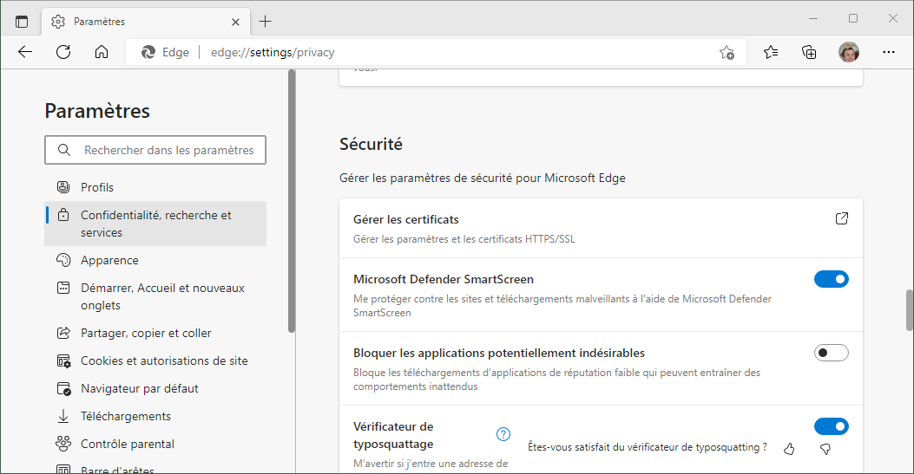
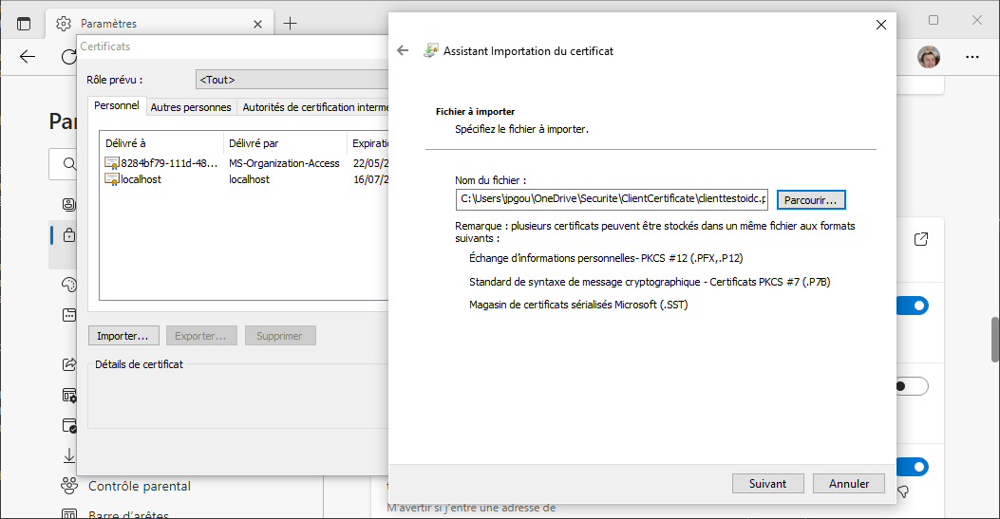
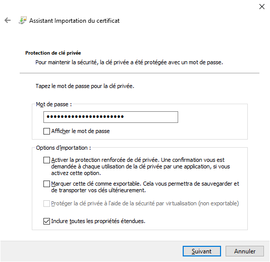

# TestOIDCBlazorWASM

Cette application exemple montre un **client Blazor WebAssembly** qui se connecte à un **serveur ASP.NET Core** qui porte le téléchargement de la Single Page Application ainsi qu'une exposition d'API, les deux étant authentifiés par un serveur d'identité **OpenID Connect** implémenté en **KeyCloak**. La persistance de l'API est assurée par une base **MongoDB** pour les données, et une **GED Nuxeo** appelée en norme CMIS pour les documents. Les documents sont générés en asynchrone par un client **console .NET Core** qui lit une queue de message **RabbitMQ** et modifie la persistance par une seconde entrée d'API, protégée cette fois par un mécanisme **ClientCertificate**. Cette seconde exposition d'API se fait sur un autre port que la première mais avec une implémentation unique, les deux contrôleurs se basant sur une seule et unique classe abstraite, en ne surchargeant que les politiques d'accès.

Afin de ne pas encombrer le présent fichier, qui a juste pour objectif de permettre de lancer l'application, les détails sur la conception, les problèmes rencontrés, les choix architecturaux et leurs avantages seront exposés à part, sur plusieurs articles d'une même catégorie dans le blog http://gouigoux.com/blog-fr/?tag=TestOIDCBlazorWASM.

A partir de 2024, tous les articles qui compléteront la description de cette application seront désormais écrits sur la nouvelle implémentation du blog statique disponible sur https://gouigoux.com/blog-md/.

# Prérequis

Pour fonctionner, l'application a besoin des serveurs satellites suivants, pour lesquels on montrera ci-dessous la commande recommandée d'initialisation en mode Docker.

### KeyCloak

```
docker run -p 8080:8080 -d -e KEYCLOAK_ADMIN=armoire -e KEYCLOAK_ADMIN_PASSWORD=vBWtB2PloopC042cszXZ --name iam quay.io/keycloak/keycloak:18.0.2 start-dev
```

L'interface de KeyCloak est disponible sur http://localhost:8080/admin/, et les crédentiels sont ceux indiqués en paramètre du lancement du conteneur. Le paramétrage recommandé est le suivant :

1. Créer un nouveau tenant d'authentification (```AddRealm``` en haut à gauche, le nommer par exemple ```LivreENI```)
1. A l'intérieur de ce royaume (un tenant, en langage d'IAM), créer un client avec OpenID Connect comme protocole ; dans notre exemple, il sera nommé ```appli-eni```
1. Ajouter à ce client deux URLs de redirection valides, à savoir ```https://localhost:7070/authentication/login-callback``` et ```https://localhost:7070/authentication/logout-callback``` (le numéro de port est à ajuster avec celui utilisé par le projet ```Serveur```)
1. Dans la même interface, spécifier comme Web Origin ```https://localhost:7070```, là aussi en ajustant le port en fonction du contexte applicatif
1. Toujours dans la définition du client ```client-eni```, mais cette fois dans l'onglet Roles (attention à ne pas confondre avec le menu Roles sur la gauche), ajouter deux rôles, un nommé ```administrateur``` et un autre nommé ```lecteur```
1. Dans l'onglet ```Mappers```, rajouter l'entité proposée ```client roles``` en le sélectionnant dans le menu ```Add Builtin```
1. Cliquer sur cette entité ```client roles``` pour modifier ses propriétés et activer l'option ```Add to ID token```
1. Vérifier que le critère ```JSON Claim Type``` est bien sur ```String``` (le mode ```JSON``` pourrait aider, mais pas réussi à le traiter pour l'instant)
1. Ne pas oublier de cliquer ensuite sur ```Save``` pour valider ces modifications de la façon dont les rôles seront envoyés
1. Changer d'interface en cliquant sur le menu ```Users``` sur la gauche et créer un premier utilisateur (dans notre exemple, son identifiant sera ```jpg```), en précisant nom et prénom au moins
1. Dans l'onglet ```Credentials```, spécifier un mot de passe pour cet utilisateur en désactivant le mode temporaire pour ne pas forcer la réinitialisation lors de la première connexion (ceci n'est bien sûr pas à faire en production')
1. Dans l'onglet ```Role Mappings```, choisir le rôle client ```appli-eni``` et assigner à cet utilisateur les rôles ```administrateur``` et ```lecteur```
1. Recommencer l'opération avec un second utilisateur, qu'on nommera par exemple ```gwen``` et qui aura comme unique rôle client ```lecteur```

**Attention à respecter scrupuleusement les contenus des paramètres, qui sont pour certains sensibles à la casse (nom du royaume) et pour d'autres (comme les origines web) poser problème si un caractère ```/``` est mis à la fin de l'URL**

### RabbitMQ

```
docker run -d --hostname my-rabbit -p 15672:15672 -p 5672:5672 -e RABBITMQ_DEFAULT_USER=rapido -e RABBITMQ_DEFAULT_PASS=k5rXH6wmBhE2bukfXFsz --name mom rabbitmq:3-management
```

L'interface est disponible sur http://localhost:15672 avec les crédentiels fournis ci-dessus.

### MongoDB

```
docker run -d -p 27017:27017 --name db mongo:4.4
```

Pas d'interface web de gestion par défaut, mais Robo 3T est un excellent client, qui peut être téléchargé sur https://github.com/Studio3T/robomongo et reste gratuit à ce jour. A noter que, par défaut, l'accès à la base de données n'est pas sécurisé. La gestion de l'authentification sur MongoDB étant une tâche un peu plus complexe que juste paramétrer un login et un mot de passe, elle est laissée de côté pour l'instant. La base de données n'étant pas exposée directement par l'ingress, on bénéficie tout de même d'un premier rideau de sécurité, qu'on peut éventuellement compléter en utilisant des règles de pare-feu de façon que seuls les serveurs applicatifs aient accès à la base de données.

### Nuxeo

```
docker run -d --name ged -p 9000:8080 nuxeo
```

Par défaut, il faut utiliser le user ```Administrator``` et le mot de passe ```Administrator``` pour se connecter aux endpoints de la GED. L'image fournie sur DockerHub ne rend pas simple de modifier les crédentiels et ne fournit par défaut pas non plus d'interface graphique qui permettrait de remédier à ce mot de passe simple par défaut. Comme pour MongoDB, il est toutefois moins grave sur cette instance de garder ce défaut de sécurité pour l'instant, car il s'agit d'un serveur de pur back office, non exposé aux clients par l'ingress. Nous utiliserons le type ```AtomPub``` accessible sur http://localhost:9000/nuxeo/atom/cmis). Comme expliqué, l'image Nuxeo ne fournit pas d'interface graphique par défaut, donc le plus simple est d'utiliser le client CMIS Apache Chemistry disponible sur http://archive.apache.org/dist/chemistry/opencmis/1.1.0/.

# Préparation des certificats

L'application utilisant pour partie une authentification de type ClientCertificate, il est nécessaire de préparer des certificats en lançant, en mode administrateur, les commandes PowerShell ci-dessous :

## Certificat racine

```
New-SelfSignedCertificate -DnsName "localhost" -CertStoreLocation "cert:\LocalMachine\My" -NotAfter (Get-Date).AddDays(365) -FriendlyName "RacineTestOIDCBlazor" -KeyUsageProperty All -KeyUsage CertSign, CRLSign, DigitalSignature
```

Cette première commande crée un certificat avec la capacité de signer un autre certificat, et donc d'agir en tant qu'autorité de certification. La durée de validité, le mot de passe ainsi que le libellé sont à adapter à votre usage, les valeurs utilisées ci-dessus étant celles reprises dans le projet. La commande affiche l'empreinte (thumbprint en jargon anglais) du certificat généré : stockez-là pour l'insérer dans la commande suivante en remplacement de ==>THUMBPRINT-RACINE<==, ainsi que dans celle, plus bas, où nous créerons un certificat signé par ce certificat dont nous allons faire une autorité.

```
Get-ChildItem -Path cert:\LocalMachine\My\==>THUMBPRINT-RACINE<== | Export-PfxCertificate -FilePath .\racinetestoidc.pfx -Password ( ConvertTo-SecureString -String "iOG76ThFD45sZ89nBGV6" -Force -AsPlainText )
```

Cette seconde commande permet d'exporter le certificat sous la forme d'un fichier PFX dont l'utilisation sera protégée par un mot de passe. Le certificat racine ```racinetestoidc.pfx``` doit être placé dans les autorités de certification racines de confiance (clic-droit et ```Toutes les tâches``` puis ```Importer...```) :


Attention à bien se positionner sur la gestion des certificats de la machine et non l'interface de gestion des certificats de l'utilisateur (le nom de l'application doit apparaître comme ```certlm``` et non comme ```certmgr```). Le mot de passe sera à indiquer lors de l'import du certificat dans la liste des autorités de certification racine.

## Certificat client

```
New-SelfSignedCertificate -DnsName "localhost" -CertStoreLocation cert:\LocalMachine\My -NotAfter (Get-Date).AddDays(365) -FriendlyName "ClientTestOIDCBlazor" -Signer ( Get-ChildItem -Path cert:\LocalMachine\My\==>THUMBPRINT-RACINE<== )
```

Ceci, comme la toute première commande, a permis de générer un certificat signé par le précédent certificat, d'où la nécessité de bien indiquer l'empreinte du certificat racine créé plus haut. La commande indique en sortie l'empreinte (thumbprint) du second certificat, qui va cette fois être utilisée ci-dessous pour créer le fichier PFX de ce second certificat, en remplaçant ==>THUMBPRINT-CLIENT<== par l'empreinte juste créée.

```
Get-ChildItem -Path cert:\LocalMachine\My\==>THUMBPRINT-CLIENT<=== | Export-PfxCertificate -FilePath .\clienttestoidc.pfx -Password ( ConvertTo-SecureString -String "oLG78hFS65gBNfx89PmPPp" -Force -AsPlainText )
```

Le point le plus important à configurer dans l'application est le serveur d'API en mode ClientCertificate qui est dans le projet **TestOIDCBlazorWASM.API**. C'est la première action de paramétrage qui sera réalisée dans la section suivante de la présente documentation. Pour réaliser cette opération, stockez soigneusement l'empreinte (thumbprint) du certificat client qui a été généré à l'instant. Il faudra la préciser dans l'attribut nommé `THUMBPRINT_CERTIFICAT` du fichier `.env`.

Bien que ce ne soit pas absolument indispensable pour le fonctionnement de l'application, mais simplement pratique pour déboguer éventuellement l'exposition d'API destinée à la consommation par des services, ce certificat "client" va être déployé dans le navigateur internet utilisé pour l'exercice. La manipulation est montrée pour Edge, mais sera très peu différente pour les autres navigateurs. Dans les paramètres, chercher une section nommée ```Certificats```, certainement dans une section sur la sécurité :



Dans la fenêtre qui apparaît, cliquer sur ```Importer...``` puis ```Suivant``` et sélectionner le fichier ```clienttestoidc.pfx``` créé plus
haut (attention à ne pas sélectionner le fichier correspondant au certificat racine) :



Cliquer à nouveau ```Suivant``` pour valider le choix et saisir le mot de passe associé au certificat client dans les commandes plus haut, en laissant
les autres options telles que proposées par défaut :



Cliquer sur ```Suivant``` et, dans l'interface qui suit, accepter le mode proposé qui va placer le certificat dans le magasin ```Personnel```.
Cliquer enfin sur ```Terminer``` et fermer la fenêtre de confirmation, puis celle de gestion des paramètres du navigateur internet.

Pour Postman, la documentation explique comment enregistrer le certificat racine ainsi que le certificat client, mais je n'ai personnellement pas réussi à trouver comment le faire fonctionner, une erreur de type ```Hostname/IP does not match certificate's altnames``` restant présente dans tous les cas d'utilisation, y compris en modifiant les options pour alléger la sécurité. Pour déboguer les API, il est donc conseillé de le faire sur le serveur **TestOIDCBlazorWASM.Server**, les deux implémentations étant garanties équivalentes par construction, hormis pour ce qui conseille les autorisations, qui suivent un modèle différent. Il faudra pour cela utiliser le paramétrage de sécurité OAuth 2.0, comme cela sera détaillé par la suite sur le blog.

# Ajustement de la configuration de l'application

Le maximum a été mis en oeuvre pour que cette application fonctionne avec le moins de manipulation possible à la suite de la récupération du code source. Il est normalement possible d'ajuster l'hôte de déploiement (en `http://localhost`, par exemple) et de lancer Docker Compose pour démarrer l'ensemble. Il faudra ensuite paramétrer l'authentification OpenID Connect et tout le scénario devrait fonctionner tel quel. Toutefois, les fichiers `.env`, `.env-iam` et `.env-ged` ont été mis en place pour simplifier le changement des paramètres par défaut.

Ces trois fichiers permettent respectivement de modifier :
1. les paramètres agissant sur le comportement de l'application de test et les liens entre les services qui la composent ;
2. les paramètres internes à l'IAM ;
3. les paramètres internes à la GED.

Afin de ne pas trop encombrer le présent fichier de documentation, un second document est disponible qui décrit précisément chacun des paramètres qu'il est possible d'ajuster, sous le nom de [README-ENV.md](./README-ENV.md).

# Lancement de l'application

Une fois les prérequis lancés, l'étape suivante avant de pouvoir lancer l'application consiste à ajuster les paramètres de façon à s'ajuster au contexte local et aux choix de l'utilisateur. La plupart des paramètres sont exposés dans les fichiers de configuration des projets (```appsettings.*```), mais nous allons commencer par paramétrer l'utilisation du certificat client pour la sécurité du projet ```TESTOIDCBlazorWASM.API```, car cette adaptation de sécurité n'est pas optionnelle.

Avant de démarrer la solution, il faut également vérifier que les propriétés de lancement sont comme suit :


La solution peut ensuite être lancée depuis Visual Studio, avec la touche ```F5``` par exemple.

# Scénario de test nominal

L'écran d'accueil montre une application "vide", au sens où n'apparaissent que les fonctions existant par défaut dans le modèle d'application .NET :


L'application est conçue pour que les menus de gestion des personnes n'apparaissent qu'une fois une authentification réalisée avec succès. Il faut pour cela utiliser le lien ```Log in``` en haut à droite de l'interface. La fenêtre qui apparaît alors est celle fournie par KeyCloak :


Si un utilisateur est connecté avec le rôle ```administrateur```, il verra alors les deux menus supplémentaires montrés ci-dessous, tandis qu'un utilisateur avec le rôle ```lecteur``` ne verra que le second :


La création d'une nouvelle personne dans l'interface dédiée provoque aussitôt une persistance dans la base de données, mais émet également un message dans une file RabbitMQ. Cette file est lue par le projet ```RecepteurMessages``` qui traite le message en créant une fiche PDF associée à la personne :


Ce traitement est suffisamment lent (grâce à un ```System.Thread.Sleep``` additionnel) pour qu'une bascule immédiate sur la liste des personnes montre une création partielle de la nouvelle entité :


En attendant quelques secondes avant d'utiliser le bouton ```Rafraichir```, on obtient une interface mise à jour dans laquelle le lien vers la GED permet de télécharger le fichier PDF généré en lien avec la personne créée (en utilisant une connexion à la GED en mode ```Basic Authentication```, gérée normalement directement par le navigateur) :


# Persistance

La persistance consiste en une simple collection dans la base MongoDB :


L'ouverture du document créé dans le scénario ci-dessus révèle la forme de l'URL permettant d'accéder à la fiche :


# Observation des documents

En-dehors de l'interface de l'application qui est extrêmement simple, il est également possible de constater le fonctionnement correct en se connectant avec le client Apache Chemistry Workbench sur la GED :


Une fois le dépôt par défaut choisi, l'interface permet de parcourir les contenus des répertoires, et en particulier celui créé automatiquement pour accueillir les PDF générés :


On peut accéder par ce biais à la fiche PDF générée, ou bien en utilisant directement le lien stocké dans MongoDB. Le contenu est généré arbitrairement, avec un appel à l'API publique de XKCD pour incorporer automatiquement une image dans le fichier :


# Structure

L'application est une solution Visual Studio 2022 avec 6 projets :

- **Client** est une SPA de type Blazor WASM qui permet à un utilisateur avec un rôle ```lecteur``` de lire une liste de personnes et un utilisateur avec un rôle ```administrateur``` de créer des personnes en plus dans la liste. L'application servant uniquement de test d'architecture, une entité de type personne ne contient que deux attributs, à savoir son prénom et son nom (ainsi bien sûr qu'un identifiant technique dans MongoDB, qui servira à créer une URL de ressource unique de type REST). L'accès à l'application est régulé par une authentification de type OpenID Connect fournie par le serveur KeyCloak. C'est le jeton d'identité JSON Web Token qui porte les rôles, en plus des autres claims standards permettant, par exemple, de nommer l'utilisateur authentifié dans le haut de l'interface.
- **Server** est une application de type ASP.NET Core qui supporte à la fois l'exposition du client SPA détaillé ci-dessus, mais aussi l'exposition de l'API REST permettant d'interagir avec les personnes sous couvert de la même authentification OIDC que le client, mais avec cette fois une utilisation du jeton d'accès JWT. Le serveur est normalement exposé sur le port 7070.
- **API** est une autre application de type ASP.NET Core qui expose la même API REST de gestion des personnes, mais cette fois derrière une authentification de type Client Certificate basée sur le certificat créé plus haut, juste après la mise en place des prérequis. Elle est dédiée aux appels par des clients de type non-interactif.
- **RecepteurMessages**, justement, est une application de type Console qui tourne en boucle, lit le contenu de la queue de messages RabbitMQ à l'écoute de nouvelles personnes, et traite cet évènement en réalisant trois tâches : générer un fichier PDF en lien avec la personne, pousser ce fichier PDF dans la GED et enfin modifier la personne pour qu'elle pointe correctement sur l'URL de cette fiche (il aurait été plus découplé de laisser l'API Personnes réaliser un appel CMIS dynamique à la GED, mais le but était de montrer ici une écriture en mode ```PATCH```). Pour cette dernière opération, ```RecepteurMessages``` utilise l'API en s'authentifiant sans compte interactif, mais par le certificat.
- **Work** contient une implémentation centralisée des deux API exposées par les projets ci-dessus, de façon à garantir un traitement de la persistance consistant, car unifié.
- **Shared** contient les classes partagées par la majorité des projets, et en particulier la classe de définition de l'entité ```Personne```.

# Références

### Configuration IAM OIDC

https://www.thinktecture.com/blazor/keycloak-authentifizierung-und-autorisierung/ a été une ressource essentielle (bien qu'en allemand) pour mettre en œuvre l'authentification OIDC du client Blazor et récupérer les rôles KeyCloak. La page "cachée" accessible par ```/identite``` sur le client est issue de https://code-maze.com/blazor-webassembly-role-based-security-with-identityserver4/, même si ce n'est pas ce fournisseur d'identité qui a finalement été utilisé. De même, https://medium.com/@marcodesanctis2/role-based-security-with-blazor-and-identity-server-4-aba12da70049 a permis de bien comprendre l'enchaînement entre ```AddOidcAuthentication``` et ```AddApiAuthorization``` même si l'IDP cité n'était pas celui choisi dans l'application de test.

L'issue https://github.com/dotnet/AspNetCore.Docs/issues/17649 a été essentielle, car la gestion des arrays JSON de rôles ne fonctionne pas bien et il est capital de les transformer en attributs multivalués, ce qui est montré dans le code fourni sur https://github.com/javiercn/BlazorAuthRoles. L'approche alternative basée sur les policies, qui permet d'aller plus loin que la gestion par rôles, vient de https://stackoverflow.com/questions/53702555/cant-access-roles-in-jwt-token-net-core. Pour des modes de fonctionnement encore plus sophistiqués, on se référera à https://referbruv.com/blog/role-based-and-claims-based-authorization-in-aspnet-core-using-policies-hands-on/, même si ces approches n'ont pas été utilisées ici.

Avant que les appels par défaut de l'exemple Visual Studio d'application Blazor ne soient supprimés, la page https://docs.microsoft.com/en-us/aspnet/core/blazor/security/webassembly/additional-scenarios?view=aspnetcore-6.0 avait été consulté pour déterminer comment appliquer des politiques de sécurité différenciées.

### Mode Client Certificate

https://www.yogihosting.com/certificate-authentication/ a fourni la bonne séquence pour créer les certificats, de nombreuses autres ressources n'étant pas assez détaillées voire carrément incorrectes. Toutefois, l'implémentation sur le serveur .NET ne montrait pas comment spécifier le certificat à utiliser, ce que faisait https://damienbod.com/2019/06/13/certificate-authentication-in-asp-net-core-3-0/. Pour aller plus loin sur les options côté client, https://stackoverflow.com/questions/40014047/add-client-certificate-to-net-core-httpclient est un excellent point de départ, et pour une liste exhaustive des options, il y a toujours la documentation officielle https://docs.microsoft.com/en-us/aspnet/core/security/authentication/certauth?view=aspnetcore-6.0.

### Mécanisme de queues de messages

https://www.rabbitmq.com/tutorials/tutorial-two-dotnet.html explique le mécanisme d'acknowledgement des messages consommés sur une queue RabbitMQ.
